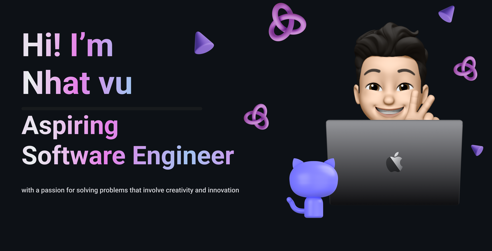

# 👋🏼 Hello World! I'm Nhat Vu  
### 💻 Computer Science Student @ De La Salle Lipa (DLSL)

## 🌐 Portfolio [nhatvu.life**](https://www.nhatvu.life/)

# 💻 Tech Stack:

<picture>
  <source media="(prefers-color-scheme: dark)" srcset="https://raw.githubusercontent.com/Coconhat/Coconhat/output/github-snake-dark.svg" />
  <source media="(prefers-color-scheme: light)" srcset="https://raw.githubusercontent.com/Coconhat/Coconhat/output/github-snake.svg" />
  
</picture>
